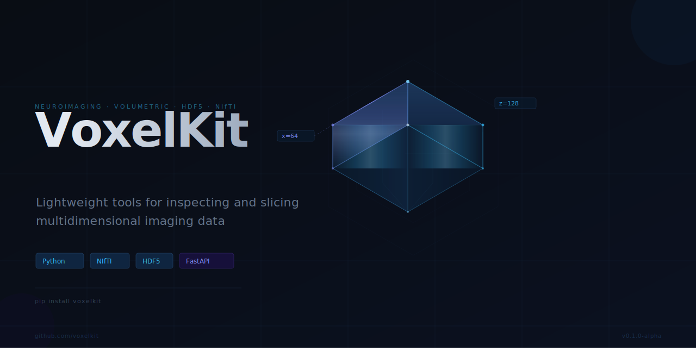

# VoxelKit



[](https://www.python.org/)
[](https://fastapi.tiangolo.com/)
[](#features)
[](LICENSE)
[](#roadmap)

Library-first toolkit for inspecting and previewing multidimensional imaging data.
The FastAPI app in `app/` is intentionally a thin HTTP wrapper around the reusable Python library in `voxelkit/`.

## Motivation

VoxelKit removes repetitive one-off scripts for inspecting and previewing imaging datasets during development and research workflows.

## Features

- HDF5 recursive structure inspection
- HDF5 dataset slice preview (PNG)
- NIfTI metadata extraction
- NIfTI preview slice generation (PNG)
- Direct Python usage through `voxelkit/` modules
- HTTP usage through FastAPI endpoints

## Installation

```powershell
cd VoxelKit
pip install -r requirements.txt
```

## Quickstart

### 1) Use As A Python Library

```python
from voxelkit.h5 import inspect_h5, preview_h5
from voxelkit.nifti import nifti_metadata, preview_nifti

h5_info = inspect_h5("tests/fixtures/sample_nested.h5")
nifti_info = nifti_metadata("tests/fixtures/sample_3d.nii.gz")

h5_png = preview_h5(
	file_path="tests/fixtures/sample_nested.h5",
	dataset_path="data/subject01/run1/bold",
	axis=2,
	slice_index=3,
)

nifti_png = preview_nifti(
	file_path="tests/fixtures/sample_3d.nii.gz",
	plane="axial",
	slice_index=4,
)

with open("h5_preview.png", "wb") as f:
	f.write(h5_png)

with open("nifti_preview.png", "wb") as f:
	f.write(nifti_png)
```

### 2) Run The API

```powershell
py -m uvicorn app.main:app --reload
```

### 3) Open API Docs

- Swagger UI: `http://127.0.0.1:8000/docs`

## API Endpoints

- `POST /h5/inspect`
- `POST /h5/slice`
- `POST /nifti/metadata`
- `POST /nifti/preview`
- `GET /health`

## API Usage Examples

### NIfTI Metadata

```bash
curl -X POST "http://127.0.0.1:8000/nifti/metadata" \
	-F "file=@tests/fixtures/sample_3d.nii.gz"
```

### NIfTI Preview

```bash
curl -X POST "http://127.0.0.1:8000/nifti/preview?plane=axial&slice_index=4" \
	-F "file=@tests/fixtures/sample_3d.nii.gz" \
	--output nifti_preview.png
```

### HDF5 Inspect

```bash
curl -X POST "http://127.0.0.1:8000/h5/inspect" \
	-F "file=@tests/fixtures/sample_nested.h5"
```

### HDF5 Slice

```bash
curl -X POST "http://127.0.0.1:8000/h5/slice?dataset_path=data/subject01/run1/bold&axis=2&slice_index=3" \
	-F "file=@tests/fixtures/sample_nested.h5" \
	--output h5_preview.png
```

## Project Layout

```text
voxelkit/
  core/      # shared cross-format utilities (validation, types, errors, normalization)
  h5/        # HDF5 inspect/preview logic
  nifti/     # NIfTI metadata/preview logic

app/
  routers/   # thin FastAPI wrappers over voxelkit library functions
```

## Test Fixtures

Generate tiny deterministic fixtures for local testing/demo:

```powershell
py tests/create_fixtures.py
```

This creates:

- `tests/fixtures/sample_3d.nii.gz`: small 3D NIfTI volume
- `tests/fixtures/sample_2d.h5`: 2D HDF5 dataset at `image`
- `tests/fixtures/sample_3d.h5`: 3D HDF5 dataset at `volume`
- `tests/fixtures/sample_nested.h5`: nested HDF5 dataset at `data/subject01/run1/bold`

## Running Tests

```powershell
pytest -q
```

## Roadmap

- multi-file request support
- CI for tests
- docs expansion for format-specific library usage
- pip packaging

## Contributing

Please see [CONTRIBUTING.md](CONTRIBUTING.md) for contribution workflow, coding standards, and pull request guidance.

## Disclaimer

VoxelKit is a developer/research utility tool. It is not a clinical decision system and must not be used for diagnosis or treatment decisions.
